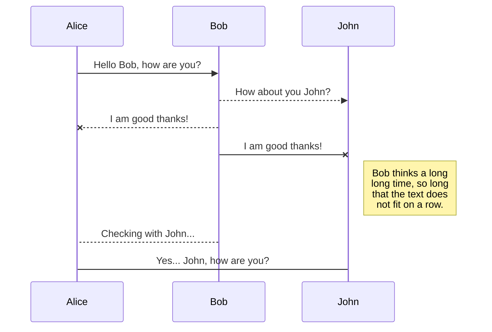
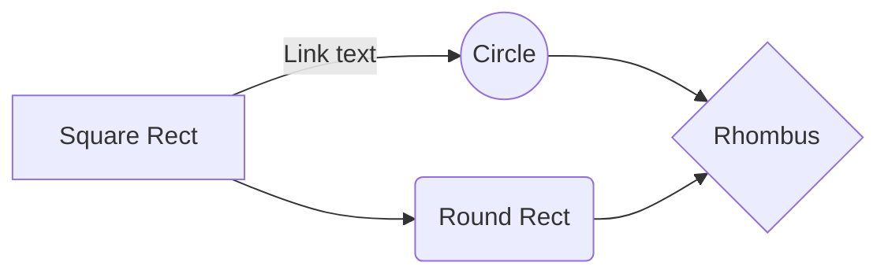

# **My Game: TwentyFourtyEight - 2048**
This is a remake of the classic game designed by the Italian web developer Gabriele Cirulli **2048** using python and kivy to create and interactive GUI that tracks scores, highscores(reset on closure of the program) and allows for infinite replays.

## GamePlay

StackEdit stores your files in your browser, which means all your files are automatically saved locally and are accessible **offline!**

#### Here is a link to a video of the gameplay : insert link here

## Logic/Win/Lose Conditions

### Win Condition

If there is a tile with 2048 value, the person has won  and the game will end      

    def  check_state(self,board):
    
	    for i in  range(4):
    
		    for j in  range(4):
    
			    if board[i][j] == 2048: 
				    return  'win'

### Ongoing Condition 1
If the above condition is not met, then first check for an empty tile denoted as a 0 in the array representing the gameboard.
i.e. [[0, 2, 2, 2], [2, 2, 2, 2], [2, 2, 2, 2], [2, 2, 2, 2]] has an empty spot in row 1, column 1

			    if board[i][j] == 0: 
    
				    return  'ongoing1'

### Carry on Conditions

You can save any file of the workspace to **Google Drive**, **Dropbox** or **GitHub** by opening the **Synchronize** sub-menu and clicking **Save on**. Even if a file in the workspace is already synced, you can save it to another location. StackEdit can sync one file with multiple locations and accounts.

### Lose Condition

Once your file is linked to a synchronized location, StackEdit will periodically synchronize it by downloading/uploading any modification. A merge will be performed if necessary and conflicts will be resolved.

If you just have modified your file and you want to force syncing, click the **Synchronize now** button in the navigation bar.

# Markdown extensions

StackEdit extends the standard Markdown syntax by adding extra **Markdown extensions**, providing you with some nice features.

> **ProTip:** You can disable any **Markdown extension** in the **File properties** dialog.

## SmartyPants

SmartyPants converts ASCII punctuation characters into "smart" typographic punctuation HTML entities. For example:

|                |ASCII                          |HTML                         |
|----------------|-------------------------------|-----------------------------|
|Single backticks|`'Isn't this fun?'`            |'Isn't this fun?'            |
|Quotes          |`"Isn't this fun?"`            |"Isn't this fun?"            |
|Dashes          |`-- is en-dash, --- is em-dash`|-- is en-dash, --- is em-dash|

## UML diagrams

You can render UML diagrams using [Mermaid](https://mermaidjs.github.io/). For example, this will produce a sequence diagram:

And this will produce a flow chart:

