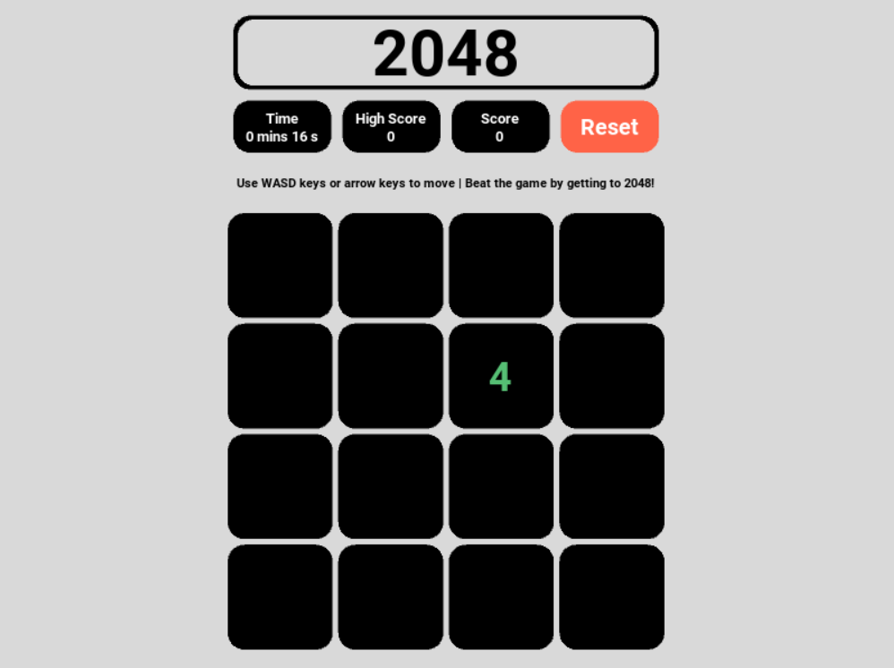
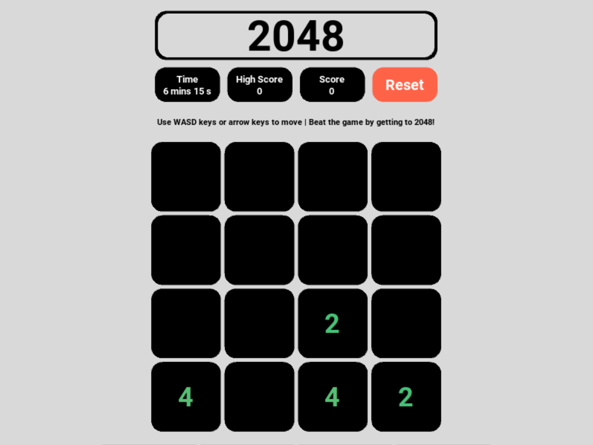
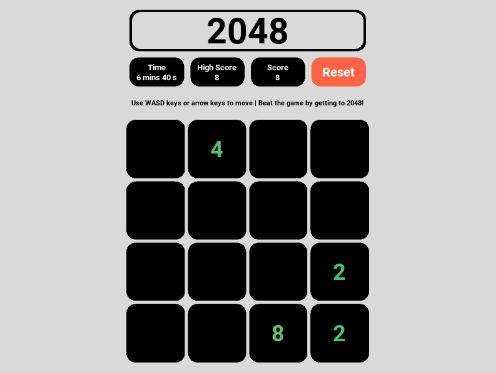
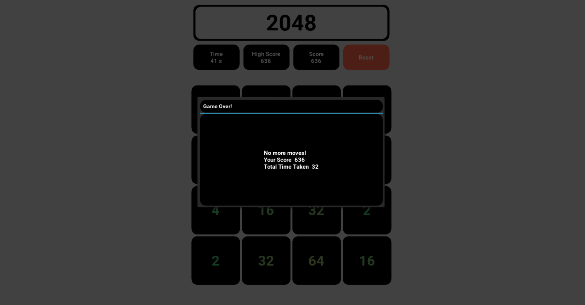
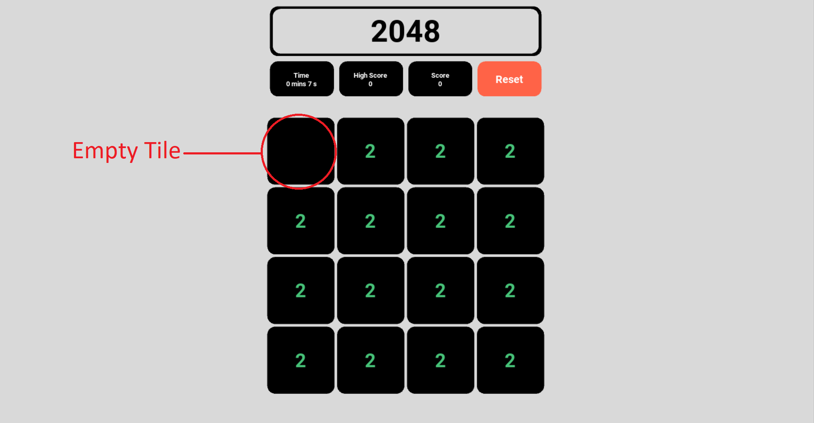
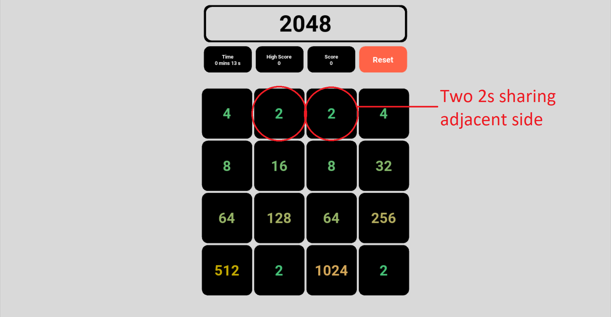

# **My Game: TwentyFourtyEight - 2048**
[SUTD | 10.009 | The Digital World ]

This project is a remake of the classic game designed by the Italian web developer Gabriele Cirulli **[2048](https://2048game.com/)** using python and kivy to create an interactive GUI that tracks time taken, highscores (reset on closure of the application window) and allows for infinite replays. This project was done in the month of April in the year 2020 for the purposes of the module: SUTD 2010 FRESHMORE - 10.009 : The Digital World 

----------

## Built With
- Python 3
- Kivy 2.0.0cr2

----------
## GamePlay
Here is a link to a video of the gameplay : Video

On running the app, user will be greeted with the below GUI. 
 
 
 
The user can then play the game, using the 'W', 'A', 'S', 'D' keys or the keyboard's arrow keys to shift the board in the respective direction. A timer will be started upon opening the game that keeps track of the total session time.
###Combining Blocks/Score
Score will be added upon combination of 2 blocks forming a block with a larger value.

Combination of the 2 '4' blocks resulted in an '8' block, adding 8 to the session score. Since the session score is higher than the current High Score, the high Score will be updated simultaneously.

### Winning/Gameover
When there are no more possible moves for the user to take, the game would end and a popup like the one shown below would appear, showing the total session time and the score achieved

A similar screen is shown when a user wins the game by combining two '1024' blocks into a '2048' block.

### Resetting
Upon winning or encountering the gameover screen, the user can exit the popup and click upon the 'Reset' button to  enjoy another game of 2048!

----------
## Logic/Win/Lose Conditions
After every move, the entire board is evaluated to determine the state of the board (Ongoing/Win/Lose) and the next state of the board is then decided. This is done with the method called check_state as shown below:

    def check_state(self,board):
        for i in range(4):
            for j in range(4):
                if board[i][j] == 2048:
                    return 'win'
                if board[i][j] == 0:    
                    return 'ongoing1'  
        for i in range(3):
            for j in range(3): 
                if board[i][j]==board[i][j+1] or board[i][j]==board[i+1][j]: 
                    return 'ongoing2'
            if board[3][i]==board[3][i+1] or board[i][3]==board[i+1][3]:
                return 'ongoing3'
        return 'gameover'       

 The sections below illustrates and explains how method decides the state of the board as well as the logic behind its decisions.

### Win Condition
Firstly, the method checks if there is a tile with the 2048 value. If the tile exists on the board at the end of the turn, the player would have won and the game would have ended.

    def  check_state(self,board):
    
	    for i in  range(4):
    
		    for j in  range(4):
    
			    if board[i][j] == 2048: 
				    return  'win'

### Ongoing Condition 1
If the above condition is not met(no 2048 tile), the method then checks for an empty tile denoted as a 0 in the array representing the gameboard. If a 0 element exists in the array, the method recognises this as an empty tile and that the game is not over as there are still possible moves.
i.e. [[0, 2, 2, 2], [2, 2, 2, 2], [2, 2, 2, 2], [2, 2, 2, 2]] has an empty spot in row 1, column 1

			    if board[i][j] == 0: 
    
				    return  'ongoing1'

### Ongoing Condition 2
If the above two conditions fail, the method will default to check for these two conditions. These conditions check for numbers that corresponds that share an adjacent side, hence allowing for another move and thus the game is not over -- Ongoing.

		for i in range(3):
            for j in range(3):
                if board[i][j]==board[i][j+1] or board[i][j]==board[i+1][j]: 
                    return 'ongoing2'
            if board[3][i]==board[3][i+1] or board[i][3]==board[i+1][3]:
                return 'ongoing3'

### Lose Condition
If all above conditions are not met, the game would be over and hence the method would deem it as gameover

        return 'gameover' 

----------
## Future Expansions
Some future plans include:
- Cleaning up spaghetti code
- Animating the combination and sliding of the blocks 
- Saving the user highscore to an online database to ensure integrity of highscore upon window closure
- Online implementation
- PVP 2048?

----------
This project was done in the month of April in the year 2020 for the purposes of the module: SUTD 2010 FRESHMORE - 10.009 : The Digital World 
